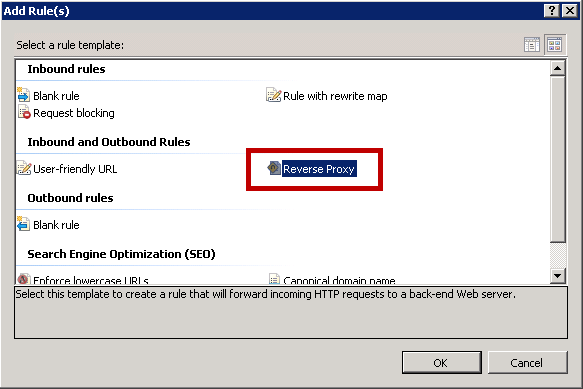
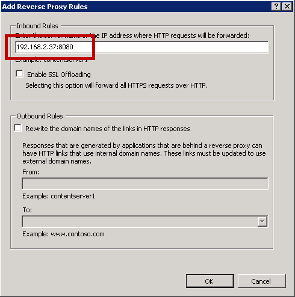
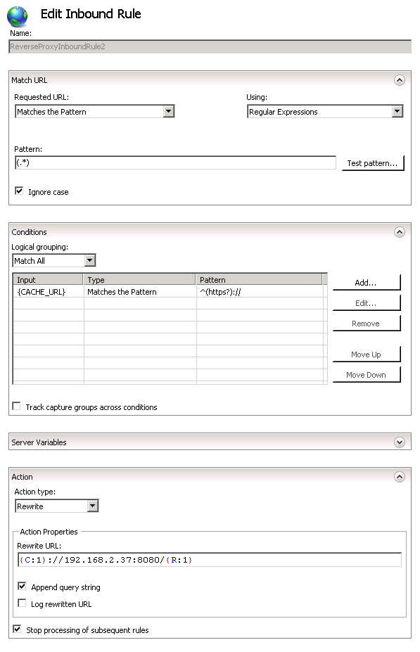
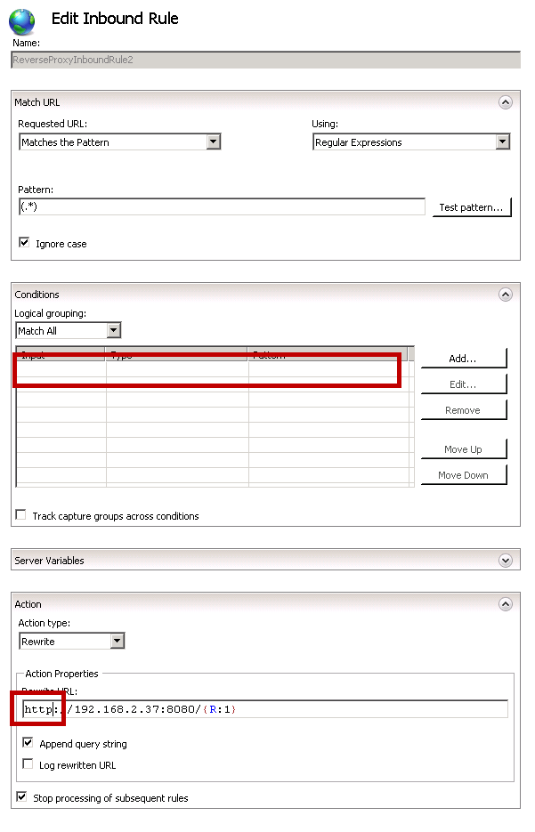

You want to run Jenkins on port 80 on your windows machine, huh? It's easier said than done. 

Well, it used to be before I wrote this blog post. If you're like me, you've already spent some time trying to get this to work the way you would expect it to work like the Jenkins documentation alludes to:
* Open `Jenkins.xml`
* Set `--httpPort=80` in the command line section

Seems fairly easy doesn't it? Well, as you've probably already figured out, it doesn't work.

Jenkins, apparently, cannot bind to a 'system' reserved port (anything below 1024).

Again, if you're like me, you fiddled with this for a while. Setting the windows service to run as Local Account/Network Account/Local Admin/Domain Admin/etc/etc/etc, Nothing works.

Then, you start searching the internet and find out this is a real problem that people have been struggling with for a while, and apparently, you can solve it by installing Apache.

Now, don't get me wrong, I have nothing against Apache, though I haven't used it in a while, I use to use it quite exclusively. For this installation, however, I didn't feel like attempting to get that work, and wondered if it would be just as possible with IIS - which was already installed.

I finally figured out the secret recipe for getting it to work, and it goes a little something like this:
* Configure Jenkins to run on whatever port you like - I left it at the default 8080
* Install IIS
* Install the IIS URL Rewrite module
* Install the IIS Application Request Routing module
* Create a 'dummy' website in IIS that is bound to port 80
* Add a 'Reverse Proxy Inbound Rule' to the dummy website that rewrites the requests from port 80 to port 8080 (on the same machine)
* Step 6 is a little more involved than the others, so, screenshots!

Pick the rule type to create (Reverse Proxy Inbound Rule)

Configure the destination IP/port on the dialog, and hit OK

Right-click the new rule, and click 'Edit' - the rule should look similar to this

Then, we're only using HTTP, so I remove the condition, and hard-code HTTP in the rewrite URL

If all is successful, you should be able to hit the 'website' running on port 80 of your server, and silently be directed to Jenkins on port 8080 without even noticing it.

If you run into any issues, or have any feedback, please leave a comment below!