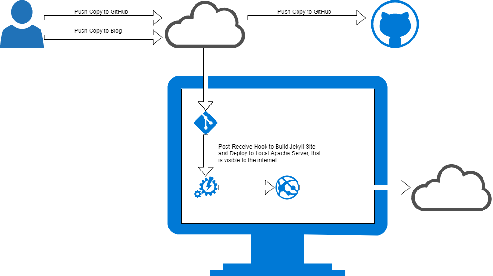

This post is pretty meta, actually, but I found it a little too interesting not to publish.

When I decided to restart my blog, I wanted to use GitHub Pages / Jekyll.  The problem with that is that I also have my own domain name, and I strongly believe in 'HTTPS ALL TEH THINGS' - which I could not do with GitHub Pages and a custom domain.

<!--more-->

I knew there had to be a way to accomplish my very simple requirements:
* Jekyll
* HTTPS/TLS
* No GitHub

Eventually, I came to the realization that all I really needed was a Linux VM, and some coffee.

My first starting point was Azure, cause I'm a Microsoft-stack kind of guy, but the price of the Linux VM that also allowed custom domains and HTTPs was over $50 USD/month.  I ain't spending that on a blog.  Then, I remember my old friend, Digital Ocean.  I knew I could spin up a low-end, but still enough for a blog, VM for about $10 USD/month, which I was much more comfortable with.

So, I signed back up, and fired up a basic Linux VM.

With the VM ready, I just had to figure out the configuration for everything -
* Ruby
* Jekyll
* Git (plus some way of building the site when I pushed changes, ala, GitHub Pages)
* Apache
* Let's Encrypt

Since I'm not a Linux guy, this took me about 4 hours to figure out.  Every article I referenced did things a little bit differently than the last, and nothing worked for me.  I ended up blowing away the VM at least 3-4 times.

Finally, after multiple attempts, I landed on the right set of apt-get installations and configuration changes to get all of this going again.

Before I dive into the configuration settings and walk-through, here is an overview of my blogging process, in graphical form:

It all starts with me, the blue guy in the upper left corner.  I make a post, and push it to my private Git repository hosted on my Linux VM from Digital Ocean.  The Git repository has a post-receive hook that clones the repository into a temporary location, does all the Jekyll magic, pushes the files into the Apache folder for the site, and then cleans up after itself.  The site in Apache is visible to the internet, and bound to a Let's Encrypt certificate that auto-renews daily via a cron job.  

You can also see an alternate path, where I can push the code to GitHub.  This is to allow anyone to fork/clone the repository (so they can start a similar site, or maybe push a change to mine).  If they decide to push a change to mine, I can integrate the change locally, and then push it to the private site.

I really like this setup (now that it's all setup and configured the way I want/need it to be)

In the next post, I'll begin outlining the steps I took on the Linux VM to make the magic happen.