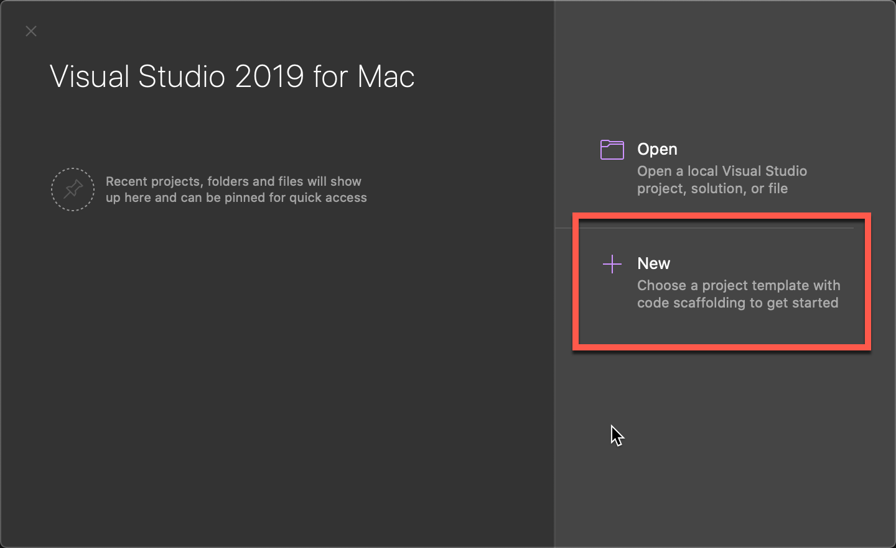

As soon as I received my Macbook at the new job, it was go time.

I had done some research on Xamarin Forms, and decided I would bring in Prism (and utilize Unity for IOC / DI).  I looked at a few different Mvvm projects - MvvmLight, FreshMvvm, Mvvm Cross, just to name a few.  Be sure to check them out if Prism doesn't suite your needs.  I ultimately chose Prism for background / history, longevity, and activity of the project.  To be fair, the other projects would have likely solved my problem just as well, but since I was fairly unfamiliar with all of these technologies, I simply had to choose and move on.  At some point, I'd love to revisit each of them individually.

Anyway, without further ado, let's dive in.

First, why did I have to make all these changes in the first place?  In my research of Prism, there appears to have been - at some point - a Visual Studio extension that comes with Prism project templates, but I kept seeing issue after issue about the extension and its integration with Visual Studio for Mac (which I had to use on this project).  Since I couldn't rely on the templates, I had to go about it the old fashioned way - trial and error and google.

The first thing we need to do is create a new Xamarin.Forms project.  There isn't anything terribly special about this, but I took some screenshots, just in case:

Upon launching Visual Studio for Mac, let's create a new project:



From the next dialog, let's choose a new Xamarin Forms, "Blank Forms App" under the Multiplatform | App category:


On the next dialog, give your app a name, identifier, and choose your target platforms.  For the sake of this article, we're selecting both Android and iOS.  We're also going to use .NET Standard for our Shared library / code.


On the final dialog of the wizard, give your project and solution a name, where to save it on disk, and whether you would like a UI Test project or not (for the sake of this article, no test project).  Lastly, hit that Create button.


After the project has finished loading, we need to add in our Prism packages.  Right click on the solution node, and click Manage NuGet Packages:


Perform a search for `prism`, and select the `Prism.Forms` and `Prism.Unity.Forms` packages, and click "Add Packages".  This will bring in a number of additional packages based on the Dependencies required.


After you click "Add Packages", you'll be presented with a dialog to select which projects you want to install the packages into.  Select them all!


With the new packages installed, we can start modifying out project for Prism usage.

First, a couple folder changes:
Add a new folder to the Shared code project, called `Views` and `ViewModels`:


With the new folders, created, let's move `MainPage.xaml` into the `Views` folder:


After you move the View, we'll need to make a couple code adjustments for namespaces and such.

Open the `MainPage.xaml` file and modify the ContentPage declaration:

1. Bring in the `Prism.Mvvm` namespace from the `Prism.Forms` assembly
2. Add the `prism:ViewModelLocator.AutowireViewModel="True"`
3. Finally, update the `x:Class` to include `Views` into the namespace

The file, should ultimately, look like this:
```xml
<?xml version="1.0" encoding="utf-8"?>
<ContentPage
    xmlns="http://xamarin.com/schemas/2014/forms"
    xmlns:x="http://schemas.microsoft.com/winfx/2009/xaml"
    x:Class="GettingStartedWithXamarinAndPrism.Views.MainPage"
    xmlns:prism="clr-namespace:Prism.Mvvm;assembly=Prism.Forms"
    prism:ViewModelLocator.AutowireViewModel="True"
    Title="Main Page"
    BackgroundColor="#fff">

    <StackLayout>
        <!-- Place new controls here -->
        <Label Text="Welcome to Xamarin.Forms, with Prism and Unity!" HorizontalOptions="Center" VerticalOptions="CenterAndExpand" />
    </StackLayout>
</ContentPage>
```

Now, open the `MainPage.xaml.cs` file, and change the namespace to include the `Views` folder.  

```csharp
using System.ComponentModel;
using Xamarin.Forms;

namespace GettingStartedWithXamarinAndPrism.Views
{
    // Learn more about making custom code visible in the Xamarin.Forms previewer
    // by visiting https://aka.ms/xamarinforms-previewer
    [DesignTimeVisible(false)]
    public partial class MainPage : ContentPage
    {
        public MainPage()
        {
            InitializeComponent();
        }
    }
}
```

It is very possible at this point that Visual Studio for Mac might get a *little* wonky with the namespacing changes, and start highlighting errors.  Ignore for now, and when we're done, closing and re-opening Visual Studio for Mac should resolve those issues.

Now, we'll add a new, empty class to act as the ViewModel for this View, named, MainPageViewModel.


Open the file (if it isn't already), and change the class to inherit from `BindableBase` and to implement `INavigatedAware`.  In the end, the file should look like this:

```csharp
using Prism.Mvvm;
using Prism.Navigation;

namespace GettingStartedWithXamarinAndPrism.ViewModels
{
    public class MainPageViewModel : BindableBase, INavigatedAware
    {
        public MainPageViewModel()
        {
        }

        public void OnNavigatedFrom(INavigationParameters parameters)
        {
            // Do work here when you're navigating away from this page
        }

        public void OnNavigatedTo(INavigationParameters parameters)
        {
            // Do work here when you're navigating TO this page
        }
    }
}
```

This is just a starting point, and other base classes and interfaces are available to use here, but you'll have to check out the Prism documentation for that.

Let's dig into the `App.xaml` and `App.xaml.cs` files for the final changes we need to make to the Shared project.

First, open the `App.xaml` file, and make two changes:

1. Bring in the Prism namespace
2. Change the Application node

Which should end up looking like this:

```xml
<?xml version="1.0" encoding="utf-8"?>
<prism:PrismApplication
    xmlns="http://xamarin.com/schemas/2014/forms"
    xmlns:x="http://schemas.microsoft.com/winfx/2009/xaml"
    xmlns:prism="clr-namespace:Prism.Unity;assembly=Prism.Unity.Forms"
    x:Class="GettingStartedWithXamarinAndPrism.App">
    <Application.Resources>
    </Application.Resources>
</prism:PrismApplication>
```

Second, open the `App.xaml.cs` file to make a few changes:

1. Change the inheritance so that `App` inherits from `PrismApplication`
2. Implement necessary methods, `OnInitialized` and `RegisterTypes`
3. Register your pages (for now, just navigation, but this is also where you would add additional services into the container)
4. In the `OnInitialized` method, we need to call the Prism navigation service and tell it where we want to go.  In this example, we'll use the NavigationPage built into Prism and 'Navigate through it' to our initial starting page.  This gives us a simple container around our page to use for back / forward navigation and space for the page Title.

In the end, the `App.xaml.cs` should look like this:

```csharp
using GettingStartedWithXamarinAndPrism.Views;
using Prism;
using Prism.Ioc;
using Prism.Unity;
using Xamarin.Forms;

namespace GettingStartedWithXamarinAndPrism
{
    public partial class App : PrismApplication
    {
        public App(IPlatformInitializer platformInitializer) : base(platformInitializer)
        {
        }

        protected override async void OnInitialized()
        {
            InitializeComponent();
            await NavigationService.NavigateAsync("NavigationPage/MainPage");
        }

        protected override void RegisterTypes(IContainerRegistry containerRegistry)
        {
            containerRegistry.RegisterForNavigation<NavigationPage>();
            containerRegistry.RegisterForNavigation<MainPage>();
        }
    }
}
```

That wraps up the changes we need to make in our shared project.  Let's move to our iOS project and make some changes there.

In the iOS project, open the `AppDelegate.cs` file and create a new class called, `IOSPlatformInitializer`, which implements `IPlatformInitializer` (remove the `throw new NotImplementedException()` from the method).  Then, Modify the `LoadApplication` call in `FinishedLaunching` and pass in a new `IOSPlatformInitializer`.  In the end, you should end up with a file similar to below.

```csharp
using Foundation;
using Prism;
using Prism.Ioc;
using UIKit;
using Xamarin.Forms.Platform.iOS;
using Xamarin.Forms;

namespace GettingStartedWithXamarinAndPrism.iOS
{
    // The UIApplicationDelegate for the application. This class is responsible for launching the 
    // User Interface of the application, as well as listening (and optionally responding) to 
    // application events from iOS.
    [Register("AppDelegate")]
    public partial class AppDelegate : FormsApplicationDelegate
    {
        //
        // This method is invoked when the application has loaded and is ready to run. In this 
        // method you should instantiate the window, load the UI into it and then make the window
        // visible.
        //
        // You have 17 seconds to return from this method, or iOS will terminate your application.
        //
        public override bool FinishedLaunching(UIApplication app, NSDictionary options)
        {
            Forms.Init();
            LoadApplication(new App(new IOSPlatformInitializer()));

            return base.FinishedLaunching(app, options);
        }
    }

    public class IOSPlatformInitializer : IPlatformInitializer
    {
        public void RegisterTypes(IContainerRegistry containerRegistry)
        {
            //register platform specific items into the IOC container here
        }
    }
}
```

Now we need to do (basically) the exact same thing in our Android project.

Open the `MainActivity.cs` file, and add an `AndroidPlatformInitializer` class that implements `IPlatformInitializer` (remove the `throw new NotImplementedException`), and add a new `AndroidPlatformInitializer` to the construction of the `App` in the `OnCreate` method.  Ultimately, you should end up with something resembling the file contents below:

```csharp
using Android.App;
using Android.Content.PM;
using Android.Runtime;
using Android.OS;
using Prism;
using Prism.Ioc;
using Xamarin.Forms.Platform.Android;
using Xamarin.Forms;
using Platform = Xamarin.Essentials.Platform;

namespace GettingStartedWithXamarinAndPrism.Droid
{
    [Activity(Label = "GettingStartedWithXamarinAndPrism", Icon = "@mipmap/icon", Theme = "@style/MainTheme", MainLauncher = true, ConfigurationChanges = ConfigChanges.ScreenSize | ConfigChanges.Orientation)]
    public class MainActivity : FormsAppCompatActivity
    {
        protected override void OnCreate(Bundle savedInstanceState)
        {
            TabLayoutResource = Resource.Layout.Tabbar;
            ToolbarResource = Resource.Layout.Toolbar;

            base.OnCreate(savedInstanceState);

            Platform.Init(this, savedInstanceState);
            Forms.Init(this, savedInstanceState);
            LoadApplication(new App(new AndroidPlatformInitializer()));
        }
        public override void OnRequestPermissionsResult(int requestCode, string[] permissions, [GeneratedEnum] Permission[] grantResults)
        {
            Platform.OnRequestPermissionsResult(requestCode, permissions, grantResults);

            base.OnRequestPermissionsResult(requestCode, permissions, grantResults);
        }
    }

    public class AndroidPlatformInitializer : IPlatformInitializer
    {
        public void RegisterTypes(IContainerRegistry containerRegistry)
        {
            // Register Android specific items into the container here.
        }
    }
}
```

That's it, those are all the changes necessary.  At this point, you can set your Android project as the startup project and run it.  With any luck, you'll (eventually) see a screen like this:


Close the Android Emulator, reset the startup project to the iOS project, and run it.  Again, with luck, you'll see a screen like this:


We're done!  Now you can begin adding views, viewmodels, navigation, etc.  I'll do a separate post on the Navigation stuff, but this should get you started!

If you're interested in just grabbing all the code for this, I've [got the project pushed up to GitHub](https://github.com/CalvinAllen/GettingStartedWithXamarinAndPrism) - feel free to fork, copy, clone, whatever. 

Enjoy, friends!
