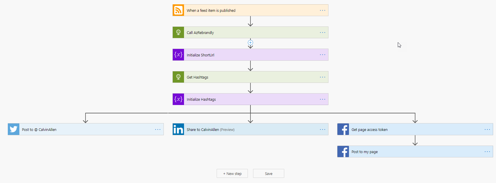

A continuation of my previous blog post about "how I blog".  In this post we'll take a look at the final four parts of my ~~7~~ 8 step process, which I'll reiterate here:

1. ~~[Jekyll](https://www.jekyllrb.com)~~
2. ~~[GitHub](https://github.com)~~
3. ~~[Netlify](https://www.netlify.com)~~
4. [Microsoft Power Automate](https://flow.microsoft.com/en-us/)
5. [Azure Functions](https://docs.microsoft.com/en-us/azure/azure-functions/functions-overview)
6. [Azure CosmosDB](https://docs.microsoft.com/en-us/azure/cosmos-db/introduction)
7. [Rebrandly](https://www.rebrandly.com/)
8. BONUS!

In the last article, we got to the point of a new post getting pushed, and going live on the blog.  

Once it's there and my RSS feed gets updated - the "fun part" happens.  I say, "fun" because all of this happens due to code and integrations that I've written specifically for this use case.

## The Technology Stack

### [Microsoft Power Automate](https://flow.microsoft.com/en-us/)

The first stop on our way begins with Microsoft's Power Automate (the product formerly known as "Flow"). If you haven't seen this before, it's a way to create a workflow, which begins with "something" triggering the workflow to begin.  In my case, it comes via the trigger called, "When a feed item is published (RSS)", and does exactly what it sounds like it's going to do.  You configure that trigger with an RSS feed to watch, and when the feed changes, the workflow - or flow - gets triggered.



Looking at the screenshot above, which is my actual "Flow", you can see it's a very linear process until we get down to the blocks that represent separate social media sites, which I post to.  The first step (after the RSS step at the very top) is called, "Call AzRebrandly", which is an HTTP call into an Azure Function that I wrote, called, surprisingly, "AzRebrandly".  This step gives me an HTTP response that I push into the next step, "Initialize ShortUrl", which produces a "short url", using my custom branded domain, "luv2.dev".  The next two steps do a similar function, but these take the tags from my original blog post and turns them into properly formed hashtags for social media.  Give those two pieces of data (short url and hashtags), I can then post the "alert" to Twitter, LinkedIn, and Facebook.  Those are side-by-side because they represent, "parallel branches", so if Twitter fails, LinkedIn and Facebook will still execute.

One caveat to this entire section is that I'm using "Premium Connectors" to do some of this stuff, which I get access to because I pay a monthly fee.  If you're looking for something similar, but free, check out "[If This, Then That (IFTTT)](https://ifttt.com/)".

### [Azure Functions](https://docs.microsoft.com/en-us/azure/azure-functions/functions-overview)

I alluded to these items in the previous section, but now we'll dive into the inner details of each one.

#### [Call AzRebrandly](https://github.com/CalvinAllen/AzRebrandly)

In the last section of this article, I'll discuss a little bit more about Rebrandly, but its a link shortening/tracking website - ala, Bitly, but better 😀.  Given that statement, you can probably figure out this custom integration, but the overall idea here stems from a limitation of the Rebrandly API/system.

If you tell Rebrandly to create a shortlink for a given URL, it will simply create it, even if you already have that link in your collection.  This causes a problem for blogging because you (mostly) will want to reuse the same link every time you post that article - I do, anyway.  So, to get around that, custom integration time!

This Azure function takes the original link as a parameter, checks a database to see if we've shortened that same link before, and then will either:

1. Use the shortlink from the database
2. Call the Rebrandly API to generate a NEW shortlink, and then store the mapping in the database

Once we've rolled through that scenario, we'll hand back the short link - in my case, back to the Flow mentioned in the previous section.  We'll dig a little deeper into the database in the CosmosDB section down below.

#### [Get Hashtags](https://github.com/CalvinAllen/AzCategories2Hashtags)

This is a little more simple, as it doesn't do anything with APIs or databases.

This Azure Function takes in the original list of tags from the blog post, sanitize them (to make sure they'll post properly as hashtags), prepend a "#" to each tag, and return the collection.

> I named this Azure Function very poorly as "AzCategories2Hashtags", but in my case, I *actually* use tags.  Luckily, I made it a little bit configurable, so I never went back and renamed it.  So, you could easily use tags *OR* categories depending on how you like to post.

For example, this post uses "meta", "blogging", and "writing", so this function would return a string, "#meta #blogging #writing", which can then be added to the messages posted out to social media sites.

### [Azure CosmosDB](https://docs.microsoft.com/en-us/azure/cosmos-db/introduction)

The "Call AzRebrandly" Azure Function mentioned above uses an Azure CosmosDB in the background to store those link mappings I mentioned.  Each mapping gets stored in the database as JSON, which looks like this:

```json
{ 
  "shortUrl": "https://luv2.dev/57l", 
  "destinationUrl": "https://www.calvinallen.net/my-blogging-process-part-1/"
}
```

Then, as I pass in various a destination URL, I can check these mappings to see if one already exists, and return the "shortUrl" that accompanies that record.

That's it.  That's all it's used for, which gets me around the Rebrandly limitation of always creating new links for destination URLs (even if one already exists).

Which brings me to...

### [Rebrandly](https://www.rebrandly.com/)

Rebrandly.  You probably haven't heard of it.  I hadn't until I wanted to use something other than Bitly.  And, you might be asking, "Why did you want to use something other than Bitly?"

The answer is quite simple.  As I've mentioned, I'm using a custom short domain, "luv2.dev", for all of the links.  Bitly charges an outrageous amount to use a custom short domain on their service, and Rebrandly does not.  In essence, it comes down to cost.

### [Dev.To](https://dev.to)

BONUS SECTION!

I cross-post my blogs onto dev.to ([https://www.dev.to/calvinallen](https://www.dev.to/calvinallen)) to try and gain a little more exposure.  Plus, the community over there is pretty awesome, so you should check it out.  Dev.to has a feature that can connect to your RSS feed, and periodically import new posts.  When it does this, it leaves them in a draft state, and you simply edit them and set "published: false" to "published: true".  Your mileage may vary here, because you *may* have to edit more of the post if the formatting went "wonky" on the way in.  I usually don't have this problem because my site and dev.to both use the same process for blog posts, so they generally come over without a problem.

### Conclusion

If you're looking to start a blog, I hope this sheds some light on "a way" you could approach it.  I am NOT saying it is the "only way", just "a way".

And, if you need any help getting started, let me know.  All my Azure Function code and blog site (all posts, etc.) are all on GitHub, so feel free.  Power Automate doesn't have a great way of sharing "Flows", but I'm more than happy to provide an export of them if you're interested, just ask.