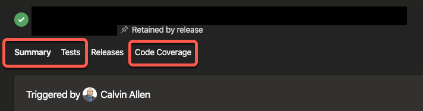
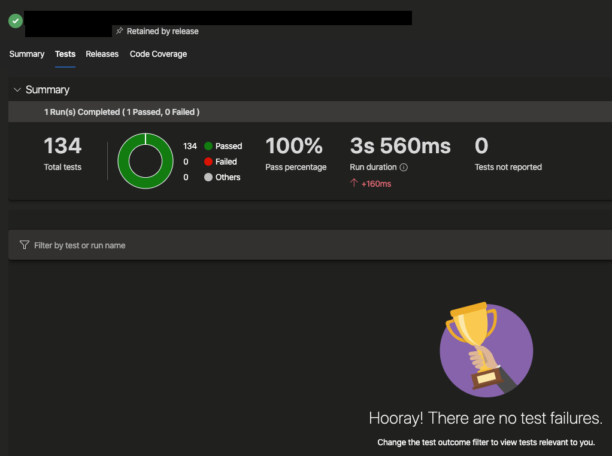
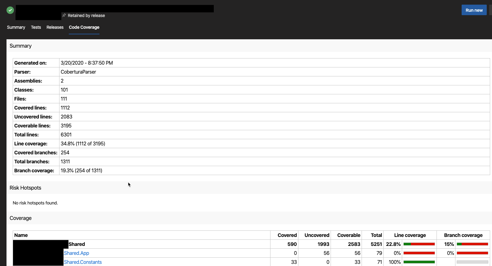

This post, "Running Your Test Suite in Azure DevOps On A Mac Build Agent And Publishing The Results", first appeared on [https://www.calvinallen.net/running-your-test-suite-in-azure-devops-on-a-mac-build-agent-and-publishing-the-results](https://www.calvinallen.net/running-your-test-suite-in-azure-devops-on-a-mac-build-agent-and-publishing-the-results)

I've been working on a Xamarin.Forms application for the last few months, and finally got to the point where I needed our CI system (in this case, Azure DevOps), to run our test suite and publish the results.  Sounds pretty easy, huh?  Well, maybe for some, but I struggled with it for a few hours because I needed to use a Mac Build Agent for the pipeline.

Hopefully, dear reader, this post will help you out, in the case you run into a similar issue.

Let's start at the "beginning" - 

In my Xamarin.Forms solution (using Visual Studio for Mac), I created a .NET Standard 3.1 class library project that will house my xUnit tests.  However, one of the first requirements for xUnit, is that we change that project from a `netstandard2.1` project, to a `netcoreapp3.1` project by editing the project file manually. [You can read more about that requirement here](https://xunit.net/docs/getting-started/netcore/cmdline) if you're interested.

After the project was created (and edited) successfully, we can add the xUnit packages from NuGet - `xunit` and `xunit.runner.visualstudio`.

Let's write some tests!  [Refer to this xUnit documentation page for 'getting started'](https://xunit.net/docs/getting-started/netcore/cmdline) writing xUnit tests.  While the page mostly refers to the command line, I was doing most of this from Visual Studio for Mac.

Now that we have some tests in our project, let's get our pipeline / macOS build agent, to build, execute, and publish the test results.  If we had been building on a Windows build agent, we would be able to follow "most" instructions found online to use the ".NET Core" task (with the 'test' command and ticking the 'Publish test results and code coverage' checkbox).  But we aren't.  So what do we do?  Well, it requires a few tasks to make this happen.

First, since I do want to collect test coverage metrics alongside of test runs, we need to go back to our project and install one more NuGet package, `coverlet.collector`.

Okay, with that out of the way, let's dig right into the pipeline tasks you'll need to make this work -

Use the .NET Core task to build your test projects.  Note that you may already be building your test projects.  I was not, because of the Xamarin.Forms iOS project being build with the "Xamarin.iOS" task.

Yours will probably end up looking something like this:

```yaml
- task: DotNetCoreCLI@2
  displayName: 'Build Test Projects...'
  inputs:
    projects: '**/*.Tests.csproj'
```

This next task, which installs a global tool, could technically come first.  As I mentioned, I struggled getting this to work at all, so once I had a sequence of tasks that worked, I left it alone :).  This task just uses the "Command Line" task, and installs a global tool for generating our code coverage reports (we'll install it here, but use it later):

```yaml
- task: CmdLine@2
  displayName: 'Install Global Tools...'
  inputs:
    targetType: 'inline'
    script: |
      dotnet tool install -g dotnet-reportgenerator-globaltool
  continueOnError: true
```

Okay, now let's run our tests.  This step again uses the ".NET Core" task, with the 'test' command.  Note that we are telling it to publish test results, but we're also adding a custom argument, which is to collect the code coverage metrics (which is important for our NEXT step):

```yaml
- task: DotNetCoreCLI@2
  displayName: 'Execute Tests...'
  inputs:
    command: 'test'
    projects: '**/*.Tests.csproj'
    publishTestResults: true
    arguments: '--collect:"XPlat Code Coverage"'
```

Tests are ran and the results published.  Now, we need to take those code coverage results and do something with those.  This took some time to figure out, because its not apparent WHERE those metrics get published.  I finally found them, in the temp directory of the agent, which you'll see referenced in the next step's YAML.  Again, we're using the "Command Line" task to execute the global report generator we installed previously, passing along the location of the results file created from the previous step, with the location of where we want the corresponding output stored, along with the report types:

```yaml
- task: CmdLine@2
  displayName: 'Execute Code Coverage ReportGenerator...'
  inputs:
    targetType: 'inline'
    script: |
      reportgenerator "-reports:$(Agent.TempDirectory)/**/coverage.cobertura.xml" "-targetdir:$(System.DefaultWorkingDirectory)/coveragereport" "-reporttypes:HtmlInline_AzurePipelines_Dark;Cobertura;Badges"
  continueOnError: true
```

Shew, okay, so we have the results created into that `targetdir` in the previous step's YAML, now how do we "publish" it to Azure DevOps?

We can use the "Publish Code Coverage Results" task for that, with some basic settings - the code coverage tool, "cobertura", and where that xml file is.  

```yaml
- task: PublishCodeCoverageResults@1
  displayName: 'Publish Code Coverage Results...'
  inputs:
    codeCoverageTool: 'cobertura'
    summaryFileLocation: '$(System.DefaultWorkingDirectory)/coveragereport/Cobertura.xml'
```

I'm not really digging into "Cobertura" here, as I don't know much about it. I piecemealed these tasks together from various sources, and that was a recurring tool mentioned, so I used it.  It works out great, so I have no reason to worry about it for now.

With any luck and a single build (unlike my 30-ish failed builds to get this working), you will "get" two tabs on your Azure DevOps pipelines build results page.  Summary, which is default, followed by "Tests" and "Code Coverage".  You'll note, in the following screenshot, that I have "Releases" as well, which is because this build actually went through the Release pipeline as well.  You may, or may not, also have that tab on any given build result page.



Flipping over to the "Tests" tab, you should see the results of the specific run of tests.



And, finally, the "Code Coverage" tab, which is embedded HTML report (it doesn't quite follow your Azure DevOps theme), followed by coverage results for each file in your projects, with rollups for the namespaces:



And, sure, we could sit here and argue that I don't have enough tests, or enough test coverage - but that's really not the point of this article is it?  Now that I know my numbers, I can monitor them, and increase them.

Thanks for reading, hope this helps somebody out!
