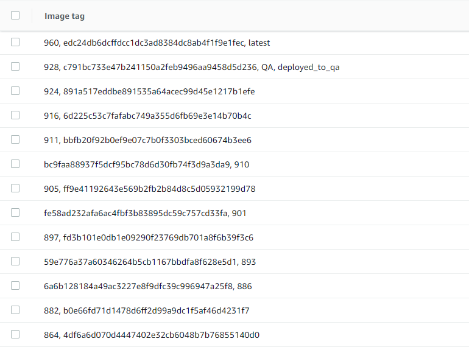

Part II of II

> [See Part I here](https://www.calvinallen.net/docker-containers-and-my-adventures-in-versioning-and-tagging/)

In my previous post, I went through how we set up versioning for our assemblies during local development, and also during our Azure DevOps pipelines.  In this post, I want to share how we did "tagging" - both to the repository, and to the docker containers.

I'll start out by telling you that adding tags to our repository proved WAY TOO noisy, and was abandoned.  I'll still share what I tried, though.

As mentioned in the previous post, we have three different pipelines for Azure DevOps - one for each potential Docker container.  And, remember, based on our configuration, a given commit could cause no containers (maybe just a README change), or up to all three (shared library change).

Going in, I thought it would be useful to know, from the repository, where a given container was built.  I started by having each pipeline create a git tag at the commit/SHA that triggered the pipeline, formatted with the container name and the corresponding `$(Build.BuildId)`.

After a handful of commits to master over the course of a day, we were up to around 10 tags.  It was apparent before the end of that first day that this was going to be WAY too noisy to keep going, and we shut it off.

That's all I'm gonna say about that.  It was a bad idea - in our scenario.  It may work better for you if you don't have as many containers, or you do it less often.

Okay, now what?  Twitter comes through again!

[Kelly Andrews](https://twitter.com/kellyjandrews) comes through with his preferred method:

<blockquote class="twitter-tweet"><p lang="en" dir="ltr">I usually tag the container with the commit sha. I like the branch tag idea though.</p>&mdash; Kelly J Andrews (@kellyjandrews) <a href="https://twitter.com/kellyjandrews/status/1247209054218391553?ref_src=twsrc%5Etfw">April 6, 2020</a></blockquote> <script async src="https://platform.twitter.com/widgets.js" charset="utf-8"></script>

That makes sense.  Instead of tagging the git SHA with the build id, tag the container with the commit SHA.  Sounds great, let's give it a go.

First, how do I get the commit SHA that *triggered* the pipeline?  I figured there could be enough of a delay that if I queried for the SHA from HEAD, that I could end up with a newer SHA that what actually triggered the pipeline.  Off to the AzureDevOps docs!

After some searching through the [Predefined Build Variables](https://docs.microsoft.com/en-us/azure/devops/pipelines/build/variables?view=azure-devops&tabs=yaml#build-variables) section of the documentation, I found what I was looking for:


> `Build.SourceVersion`
>
> The latest version control change of the triggering repo that is included in this build.
>
> * Git: The commit ID.
> * TFVC: the changeset.
>
>This variable is agent-scoped, and can be used as an environment variable in a script and as a parameter in a build task, but not as part of the build number or as a version control tag.

Perfect!  Since we're using git (who isn't these days?), all I needed to was alter our pipeline to tag our container with `Build.SourceVersion`, and then since we're also using ECR, we needed to push that tag to our (private) registry.

First, our `Docker` task was already tagging our container with `latest` and `Build.BuildId`, as shown below -

```yaml
- task: Docker@2
    displayName: Build an image
    inputs:
        # more stuff here, omitted for brevity
        tags: |
            $(Build.BuildId)
            latest
```

So, a simple modification here, just add in `Build.SourceVersion`:

```yaml
- task: Docker@2
    displayName: Build an image
    inputs:
        # more stuff here, omitted for brevity
        tags: |
            $(Build.BuildId)
            $(Build.SourceVersion)   <-- THIS PART
            latest
```

With that part completed, we just need to push the `$(Build.SourceVersion)` as a tag to the image in ECR using the `ECR Push Image` task (*AFTER* the image has been pushed, of course).  We were already pushing the `$(Build.BuildId)` separately, and `latest` goes by default on the initial push.  With that said, we ended up with this -

```yaml
- task: ECRPushImage@1
    inputs:
        # more stuff here, omitted for brevity
        pushTag: $(Build.SourceVersion)

```

Every time this pipeline pushes a new container to ECR, it will be tagged with the commit SHA that triggered it!  Now, its the "long form" SHA, not the shortened version, so its little noisy when looking at the image list in ECR, but its much better than what we started with.  And, how often do you look at the commit history in your repo compared to how often you review the list of images in your container registry?

The result ends up looking like this:



The (currently) three digit number is the `$(Build.BuildId)` and the gnarly string is the `$(Build.SourceVersion)` from AzureDevOps.  You'll see a few others in there, but those are to know which environment the container is running in - quasi unrelated to this post :).

Hope you enjoyed tagging along in my adventure...get it...tagging?

Until next time, dear reader!

>This post, "Docker Containers and my Adventures in Versioning and Tagging - Part II", first appeared on [https://www.calvinallen.net/docker-containers-and-my-adventures-in-versioning-and-tagging-part-ii](https://www.calvinallen.net/docker-containers-and-my-adventures-in-versioning-and-tagging-part-ii)
