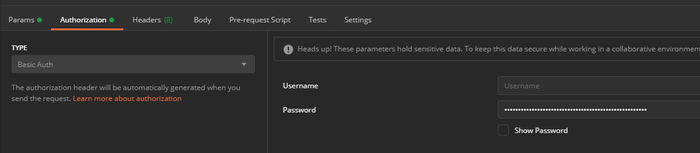
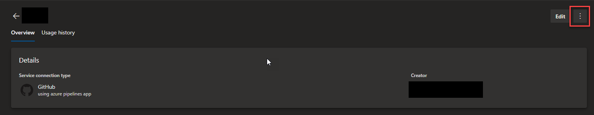
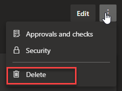
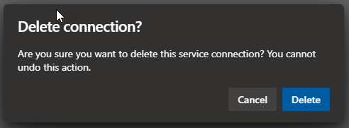

I've let them linger for too long.  It's time to figure out a way to delete the three service connections in my Azure DevOps project that don't work, and can't be deleted through the UI.  There has to be a way!

There is.  It involves the AzureDevOps API, a Personal Access Token (PAT), Postman (or curl), and some patience.

Before we dive in too far, go generate an AzureDevOps PAT under your account.  I generated mine with full permissions with a 1 day expiration.  Theoretically, you could probably get by with just giving it "Read, Query, & Manage" for the Service Connections scope.

Whatever tool you choose to make the API requests is up to you, but I prefer Postman these days.  You will need to authenticate to the APIs with Basic Authentication.  You will need to base64 encode a string comprised of a blank username, colon, and the PAT you generated earlier.  It will look something like this (C# pseudo code) - 

```csharp
var apiToken = Convert.ToBase64String($":{PAT}");
```

Alternatively, using Postman, you would use "Basic Auth", and put your PAT in the password field:



The first API call you want to make will be to [get the list of Service Endpoints](https://docs.microsoft.com/en-us/rest/api/azure/devops/serviceendpoint/endpoints/get%20service%20endpoints?view=azure-devops-rest-5.1):

```
GET https://dev.azure.com/{organization}/{project}/_apis/serviceendpoint/endpoints?includeFailed=true&api-version=5.1-preview.2
```

Replace your organization and project names as appropriate.  Note that we are explicitly saying that we also want endpoints that are in a FAILED state.  This was the only way I could get the three I wanted to delete.  Otherwise, all I received was the single endpoint that was working fine.

You'll end up with a giant [response body that includes all your service endpoints](https://docs.microsoft.com/en-us/rest/api/azure/devops/serviceendpoint/endpoints/get%20service%20endpoints?view=azure-devops-rest-5.1#serviceendpoint).  Find the "id"s for the ones you need to delete, and copy them out somewhere.  You'll need them for the next COUPLE of API calls....

Next you'll want to [retrieve the specific details for the endpoints](https://docs.microsoft.com/en-us/rest/api/azure/devops/serviceendpoint/endpoints/get?view=azure-devops-rest-5.1) (one at time, of course):

```
GET https://dev.azure.com/{organization}/{project}/_apis/serviceendpoint/endpoints/{endpointId}?api-version=5.1-preview.2
```

Again, replace the organization and project names as appropriately, but now you'll need to also replace the `endpointId` within the query as well.

This will give you another giant [response body that includes all the details for that specific endpoint](https://docs.microsoft.com/en-us/rest/api/azure/devops/serviceendpoint/endpoints/get?view=azure-devops-rest-5.1#serviceendpoint).

Using that same URL, we need to switch the verb to a `PUT` -

```
PUT https://dev.azure.com/{organization}/{project}/_apis/serviceendpoint/endpoints/{endpointId}?api-version=5.1-preview.2
```
(replace tokens as needed)

The response body you received from the previous `GET` will now be the template for the body you need to send back (with some changes).

Inside of the body, find the `creationMode` field and change the value from `Automatic` to `Manual`.

At this point, if you send the `PUT`, you will likely receive errors that some fields should be omitted from the Body.  Go ahead and remove whichever ones the error gives you, until it processes successfully.  I had to remove `azureSpnRoleAssignmentId`, `spnObjectId`, and `appObjectId` from all of mine, but you may receive others.

Assuming you get a `200 OK` response from this call, navigate to the UI that lists your service connections in Azure DevOps (`https://dev.azure.com/{organization}/{project}/_settings/adminservices`). Alternatively, navigate to the "Project Settings" in AzureDevOps for the project in question, and click "Service Connections" in the left-hand navigation menu.  

In the list of service connections, click the one that corresponds to the service connection you just modified through the API.  Then, click the kebab menu in the upper right, next to the 'Edit' button:



From the menu that drops down, click delete:



And then confirm the deletion:



With any luck, the bad connection should disappear from the UI!  Now, you just need to go back and perform the necessary API calls and deletions again for every bad connection you may have.

Luckily, I only had three, which took about 10 minutes (it took darn near an hour to figure out all the necessary steps).

I hope this helps somebody out there until we're able to delete these bad service connections from the UI without hassle.  Until then, good luck, dear reader!

---

>This post, "Deleting Failed AzureDevOps Service Connections", first appeared on [https://www.codingwithcalvin.net/deleting-failed-azuredevops-service-connections](https://www.codingwithcalvin.net/deleting-failed-azuredevops-service-connections)