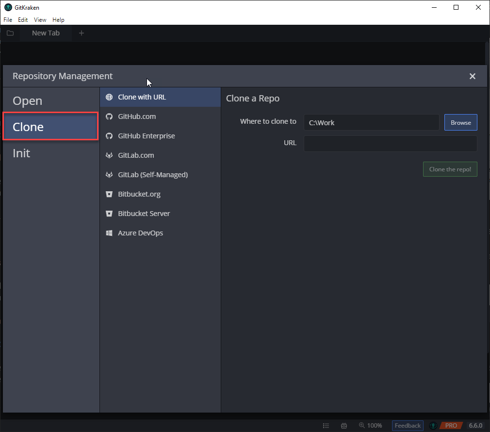
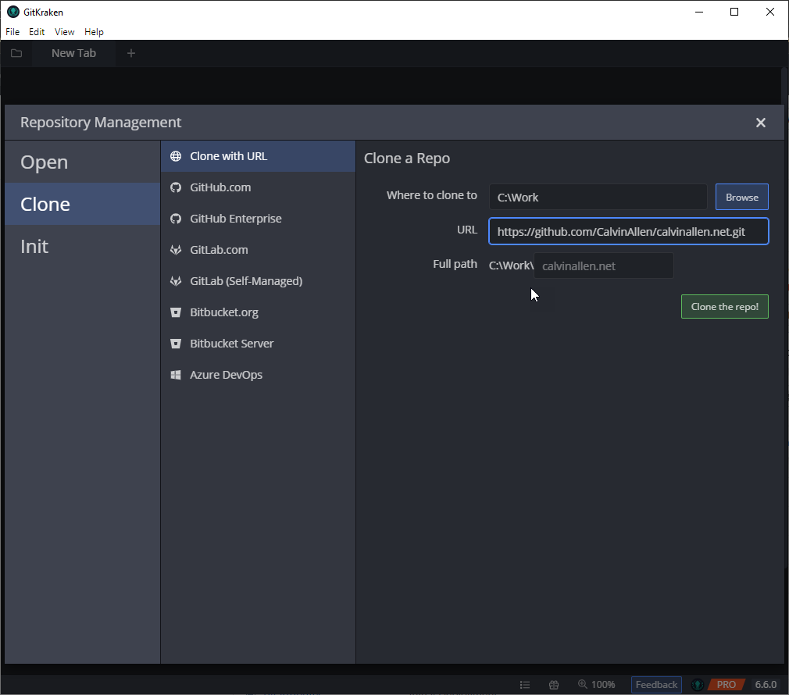
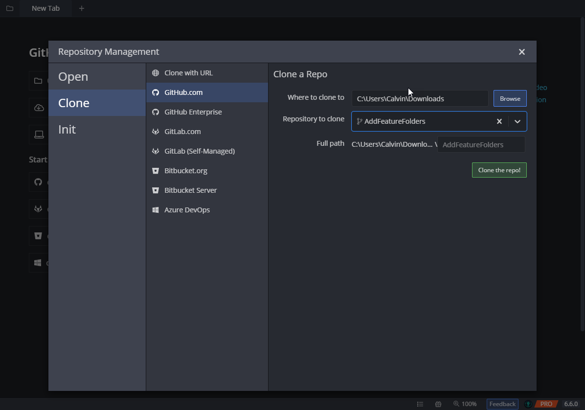

If you're new to the GitKraken Git GUI or interested in it, one of the first things you'll want to do after installing it is clone a repository so you can get to work.

There are three ways in the GitKraken Git GUI to "initiate" the cloning of a repository.  Each one of these items will lead to the same "Repository Management" popup dialog, with the "Clone" section selected, which I will show you at the end.

## Launching the Repository Management Dialog

### 1. File | Clone Repo

From the `File` menu, click on `Clone Repo`.  Alternatively, this menu item also comes with a keyboard shortcut of `CTRL + N`, if you prefer keyboard shortcuts

### 2. "New Tab" tab

From the "New Tab" page, which can be added (if you don't already have one) by clicking the `+` button in the tab bar -

Once the "New Tab" page is opened, click on "Clone a Repo" from the menu down the left-hand side -

### 3. Repository Management Icon

This one is a little more subtle, but always available in view if you need it.  On the far left of any open tabs (even the "New Tab"), there is a folder icon.  Clicking on this icon will launch the "Repository Management" popup.

## Cloning from the Repository Management Dialog

Once you've successfully launched the "Repository Management" dialog, make sure you're on the "Clone" item on the left-hand side -

When "Clone" is selected, we are presented with a multitude of providers to clone our repo from.

If all you have is a URL that doesn't correspond with any of the listed providers, you can do that using the "Clone with URL" item at the very top.  Simply provide the local folder you want to clone the repository into and the URL to the remote repository.  

For example, acquire the URL of your repository from GitHub -

And paste that value into the GitKraken Git GUI "URL" field -

With those fields provided, you will be presented with the "Full Path" field.  This pre-populates with the "Where to clone to" plus the repository name.  You can change the repository name by typing over the value in that field.

Once you're satisfied, click on, "Clone the repo!" to initiate the clone process.  The GitKraken Git GUI will ask you for credentials (if necessary), and then a progress dialog will be shown -

Once this process completes, you'll be asked if you want to open the newly cloned repository -

Clicking on "Open Now" will open a new tab in the GitKraken Git GUI to your newly cloned repository -

You're ready to work with your repository!

Now, I do want to back up just a little bit to the Repository Management dialog to take a look at another provider -

If you've authorized the GitKraken Git GUI to interact with one of these other providers (perhaps another post is warranted for that?), you can select which repository you want to clone from a list.  For example, I've authorized the GitKraken Git GUI to work with GitHub.com, so I am able to directly select which repository I want to clone -

Click the drop down, and select any repository from your account (or organizations, if you've allowed the GitKraken Git GUI access to them) -

Upon selecting a remote repository from the list, you'll be presented with the "full path" item, so you can change the local folder name the repository is being cloned into, and the "Clone the repo!" button becoming active - 

Once you click the "Clone the repo!" button, the same progress dialog will launch, as well as asking whether you would like to open the newly cloned repository, just like the URL version shown previously.

I won't show you anymore providers from the dialog, as they all work basically the exact same way, the only difference being that you will need to authorize the GitKraken Git GUI access to your accounts in those services.  Just note that, although you see multiple providers in my screenshots, some of them required a paid version of the GitKraken Git GUI to access, so please check out the [plan comparison page](https://www.gitkraken.com/pricing#plan-comparison) on the GitKraken website for more details!

## Conclusion
I hope this post has shed some light on the various ways you can clone a remote repository using the GitKraken Git GUI.  I'll be posting more "how to" articles for using the GitKraken Git GUI in the near future, as well as accompanying videos for each post. If you need any help or have any questions, please feel free to reach out directly.

If you're interested in downloading the GitKraken Git GUI client and taking it for a spin, [please do me a favor and use my referral link](https://www.gitkraken.com/invite/6zb3y67R) to get started.  No obligations, of course, if you decide to.  And, if you don't want to, we'll still be friends :).

Thanks, dear reader, hope you enjoy unleashing your inner Kraken!

---
 
> This post, "GitKraken Git GUI How-To: Cloning a Repository", first appeared on [https://www.calvinallen.net/gitkraken-git-gui-how-to-cloning-a-repository](https://www.calvinallen.net/gitkraken-git-gui-how-to-cloning-a-repository)
