In my previous post, "[GitKraken Git GUI How-To: Cloning a Repository](https://www.calvinallen.net/gitkraken-git-gui-how-to-cloning-a-repository/)", we went over how to do just that. Now that we have a repository to work with, we need to make some changes! Maybe that involves changing existing files, or adding new ones. However, just editing or creating files in the repository doesn't necessarily mean they'll be committed, pushed (future topics, I promise), and available for other folks to work with.

In *this* post, I'm going to show you how to add and remove files - or, in git lingo, stage and unstage files.  

Let's get an idea of what it means to "stage" (or "unstage") your changes in a git repository.  There are three primary reasons you might need to "stage" a file:

1. When you make a change to a "tracked" file (a file that has previously been committed to the repository, for example, a file that you received during the cloning process), it simply exists in a changed state on the file system and git knows it changed. If you were to perform a commit on the repository right now, nothing would actually happen.  We have to tell git that the changed file should be committed by "staging" it.
2. If you add a *new* file to the repository (that isn't being ignored by git - we'll dive into git ignore files soon, too!), it will simply exist on disk, and git will know it's new, but again if you commit *now*, nothing would actually happen.
3. If you delete a file that was previously being tracked.

With all three of these types of changes, nothing is ready to commit until we "stage" them.  You can see in the following screenshot, all three of these types of changes waiting to be staged -

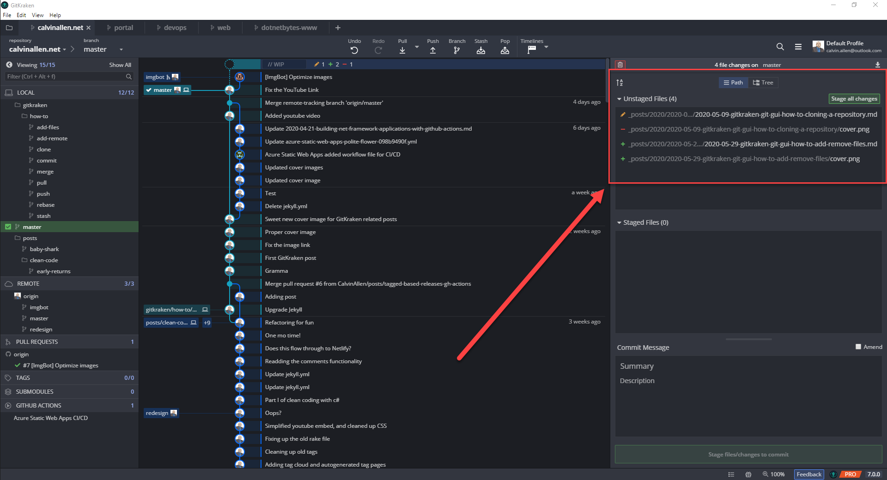

The yellow pencil icon indicates a change was made to a file.
The red dash icon indicates a file was deleted.
The green plus icon indicates a new file was created.

I can "stage" all of these changes at once by clicking the green, "Stage all changes" button in the area above the "Unstaged Files" list -

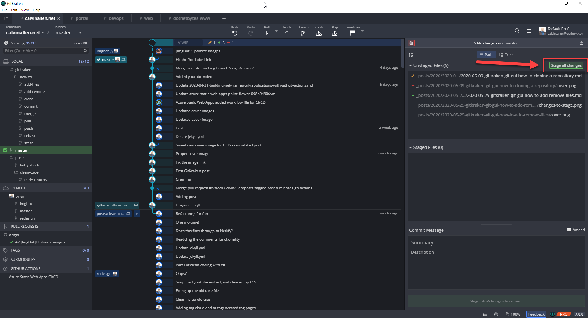

Clicking this button will move all of the lines shown from "Unstaged Files" to "Staged Files" -

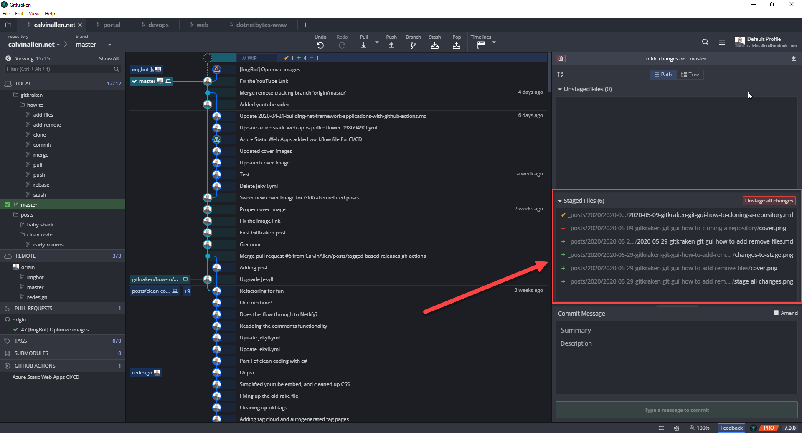

Note that all the icons remain the same in this list, so you can easily tell which type of change was staged for a given entry.

At this point, you would be ready to "commit" these changes to your local repository, if desired. But, what if you decided you weren't ready, and wanted to unstage the changes? Well, the GitKraken Git GUI gives you a simple button to "Unstage all changes" as shown in the following screenshot - 

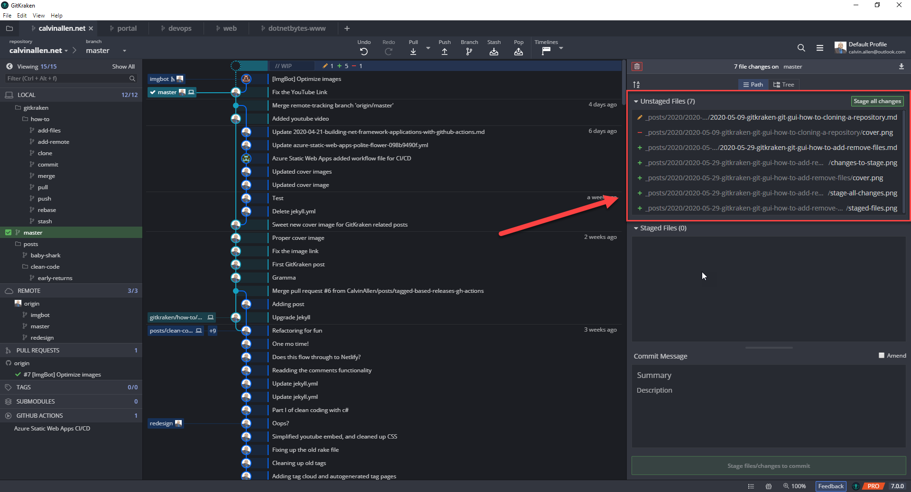

You'll see that the list moved back to the top, indicating all the changes are currently unstaged.

With that complete, you now decide you want to stage only a few of the changes.  The GitKraken Git GUI makes this easy as well.  Simply hover over the entry in the list you want to stage and a green, "Stage File" button will appear on that line, in the far right.  While still hovering over the line, mouseover the button and click it.

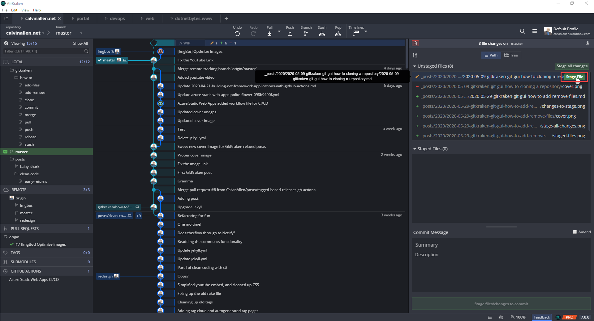

Alternatively, right click the line and choose, "Stage" from the popup menu - 

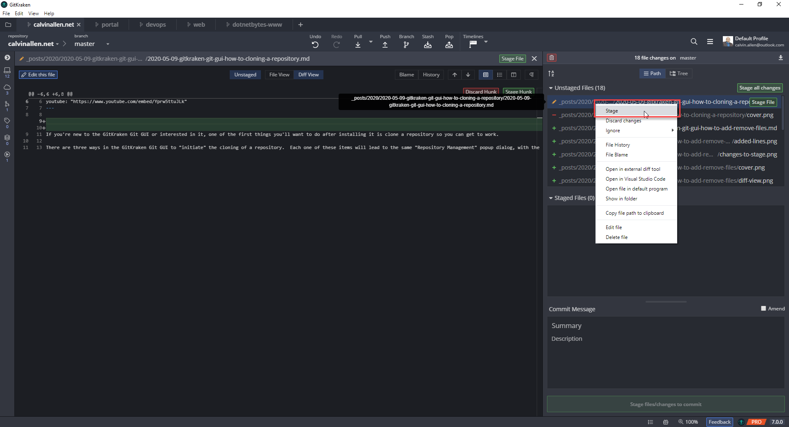

>*Be careful not to click "Discard changes", as that will revert your change - i.e., you'll lose your work!*

Doing that for a couple of the items results in the following screenshot -

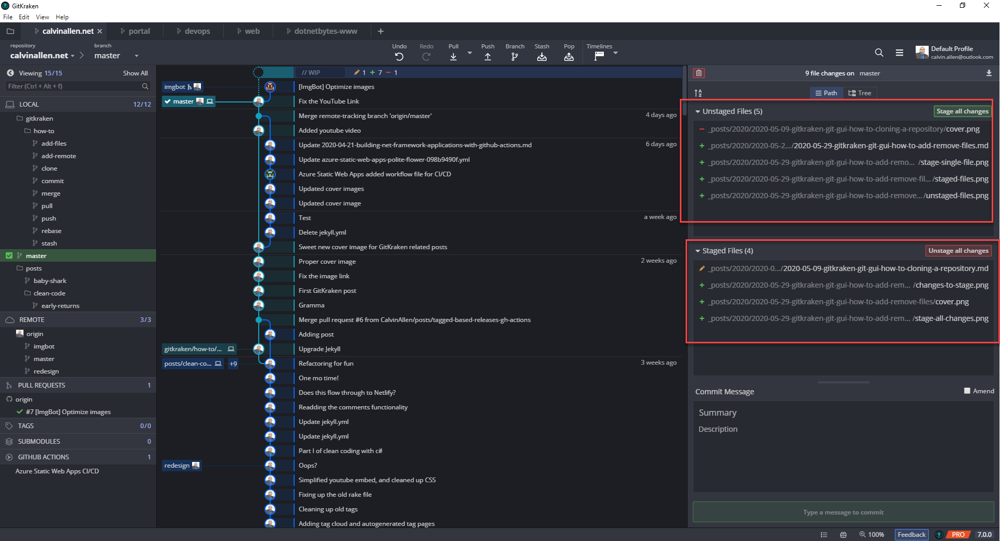

As you can see, I still have the ability to "Stage all changes" for what remains in the "Unstaged Files" section, and the ability to "Unstage all changes" in the "Staged Files" section.  Hovering over an item in the "Staged Files" section gives me a red, "Unstage File", button, similar to its green counterpart mentioned previously -

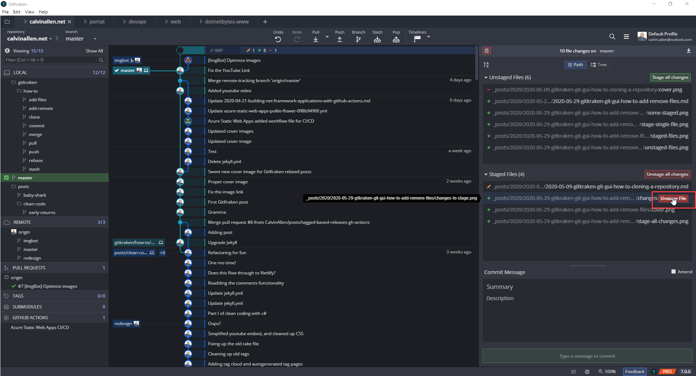

Alternatively, right click the line and choose, "Unstage" from the popup menu -

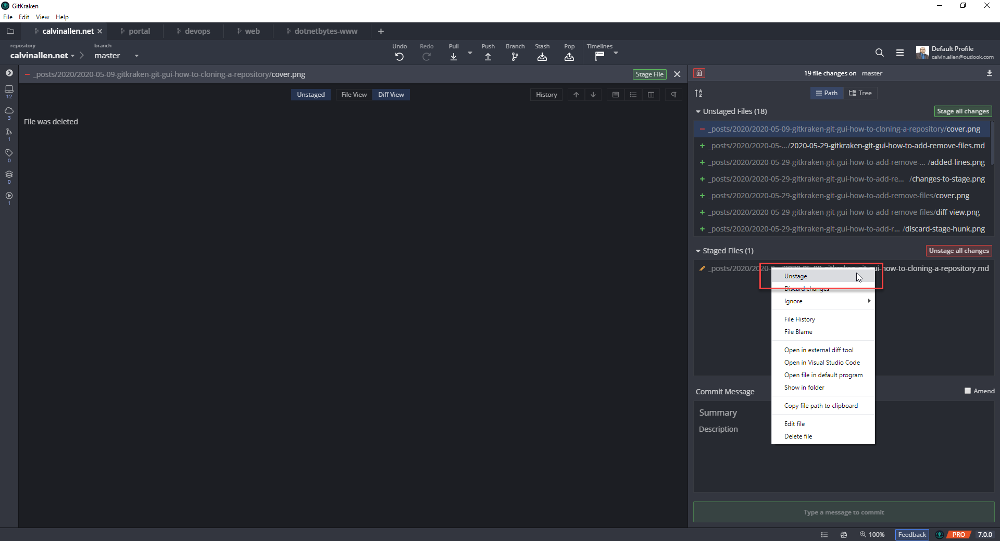
>*Be careful not to click "Discard changes", as that will revert your change - i.e., you'll lose your work!*

With the GitKraken Git GUI, you can dive even deeper into staging and unstaging, by staging individual LINES of a file or multiple lines known as "hunks".  Clicking the file in the "Unstaged Files" area will open a view allowing you to see the changes to the file -

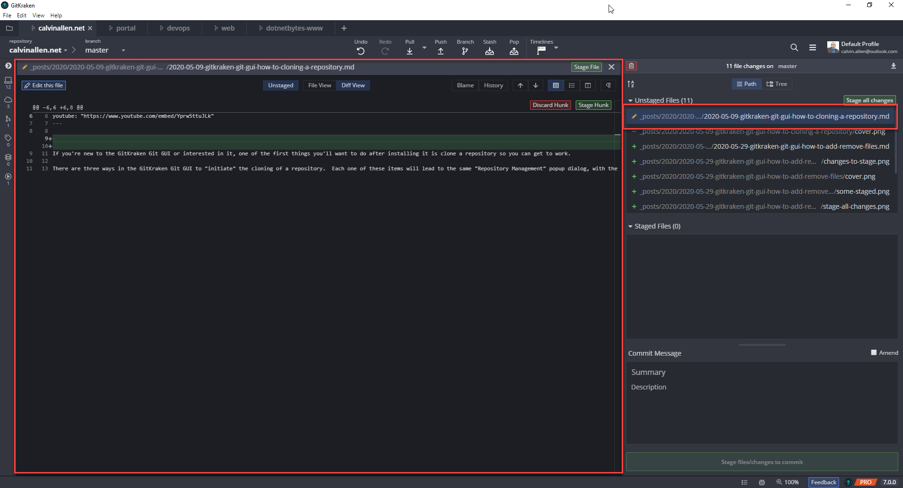

Once this view opens, you get those options I previously mentioned.  The most visible ones are "Discard Hunk" and "Stage Hunk" in the upper right area of the diff view -

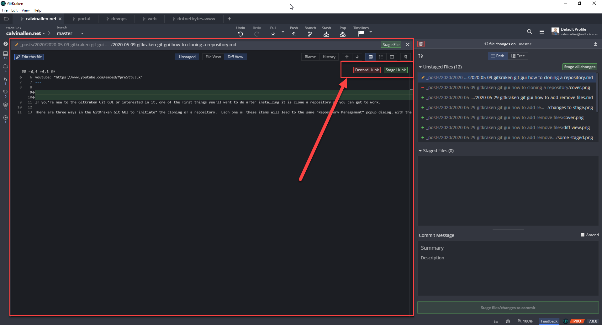

These are pretty straightforward - "discard hunk" reverts the change to the "chunk" of code that has been changed right below it.  "Stage Hunk" will stage *JUST* that chunk of code.  If you're looking at this view from a file in the "Staged Files" area, you will be presented with an "Unstage Hunk" button instead, which unstages that chunk of code.

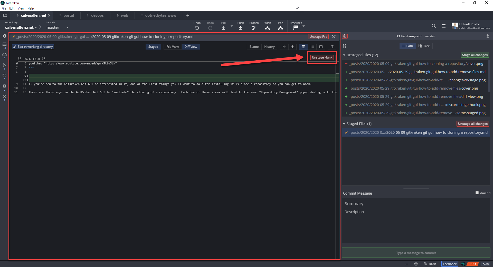

Depending on how big the file is, or how many changes you made, you very well may see *multiple* "sections" in this view that allowing you to Discard, Stage, or Unstage multiple "hunks" from a single file. These actions are presented (and useful) for file *changes*, since adding or deleting a file is an atomic operation to the actual, whereas an edited file can change all over.

The last type of "staging"/"unstaging" is at the LINE level of a changed file. I mentioned this earlier, and although its present in some of the last few screenshots, I didn't want to confuse anyone while covering "hunks".

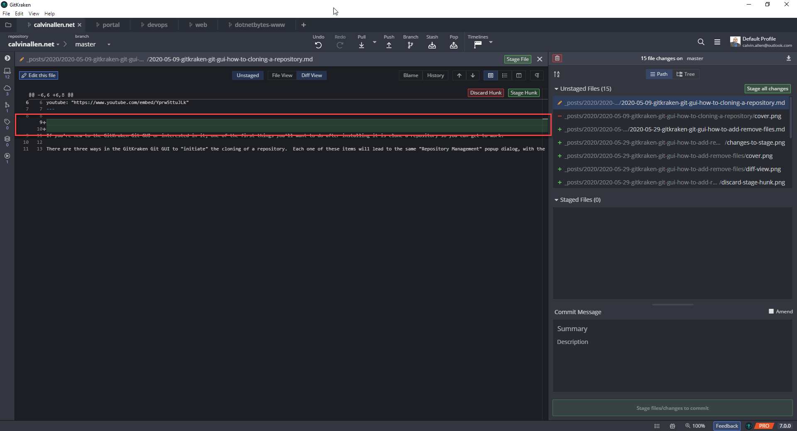

As you can see in the previous screenshot, while viewing the diff of a file in "Unstaged Files", you'll see the lines added to the file in green.  Hovering over one of these lines will reveal a green "+" (plus) indicator in the left margin. Clicking this button will stage *just that single line*.  Where "Stage Hunk" would stage *both* lines, this allows you to stage *individual* lines.  Of course, if you were hovering one of these lines for a file in the "Staged Files" area, that green "+" plus icon would be a red "-" minus icon to unstage that specific line -

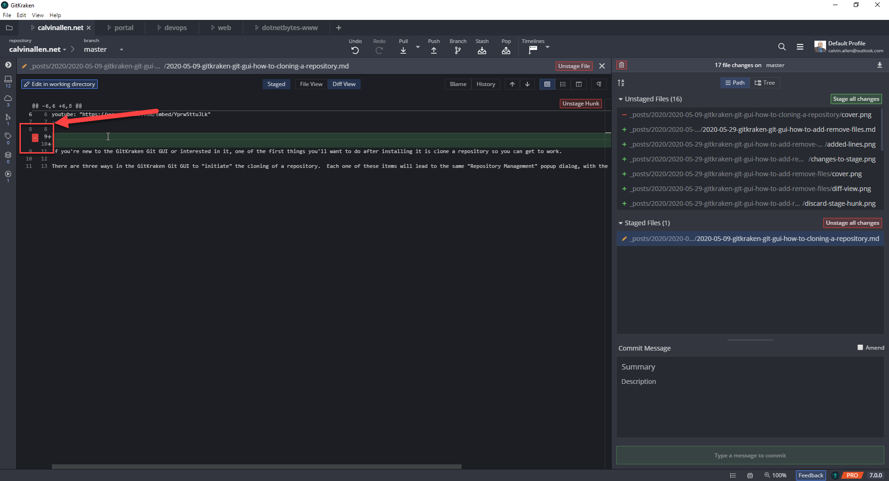

## Conclusion

There you have it - all the various ways you can add, or "stage", files/changes as well as the various ways you can remove, or "unstage", files/changes.  

I’ll be posting more “how to” articles for using the GitKraken Git GUI in the near future, as well as accompanying videos for each post (the video for this will be coming next). If you need any help or have any questions, please feel free to reach out directly.

If you’re interested in downloading the GitKraken Git GUI client and taking it for a spin, [please do me a favor and use my referral link to get started](https://www.gitkraken.com/invite/6zb3y67R). No obligations, of course, if you decide to. And, if you don’t want to, we’ll still be friends :).

---

>This post, "GitKraken Git GUI How-To: Adding Files", first appeared on [https://www.calvinallen.net/gitkraken-git-gui-how-to-add-remove-files](https://www.calvinallen.net/gitkraken-git-gui-how-to-add-remove-files)
