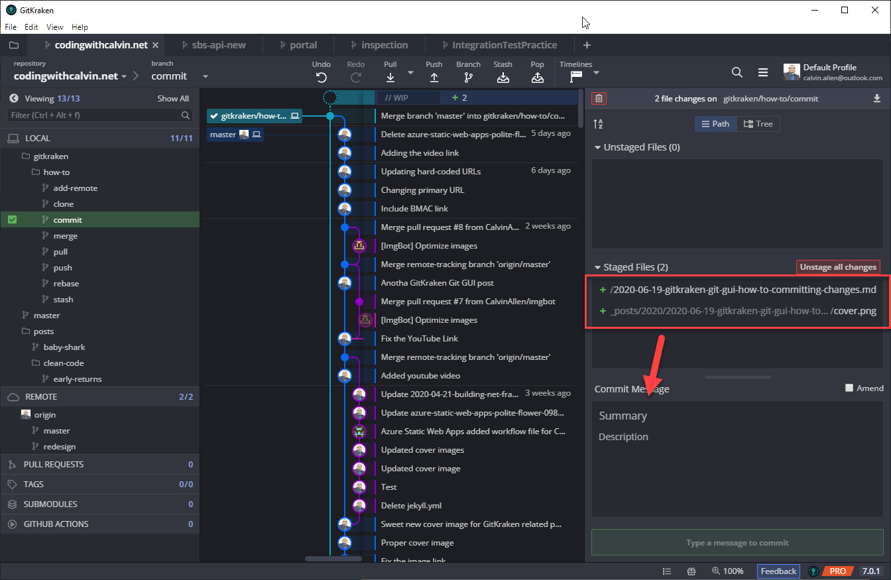
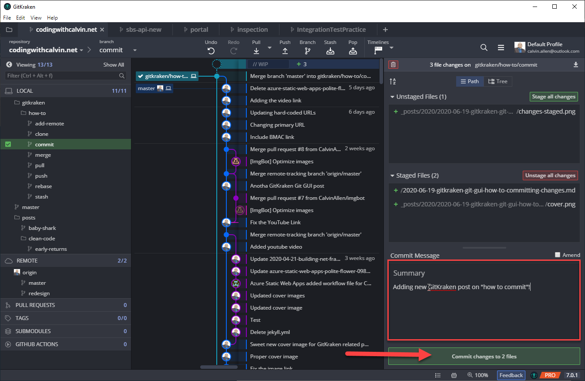
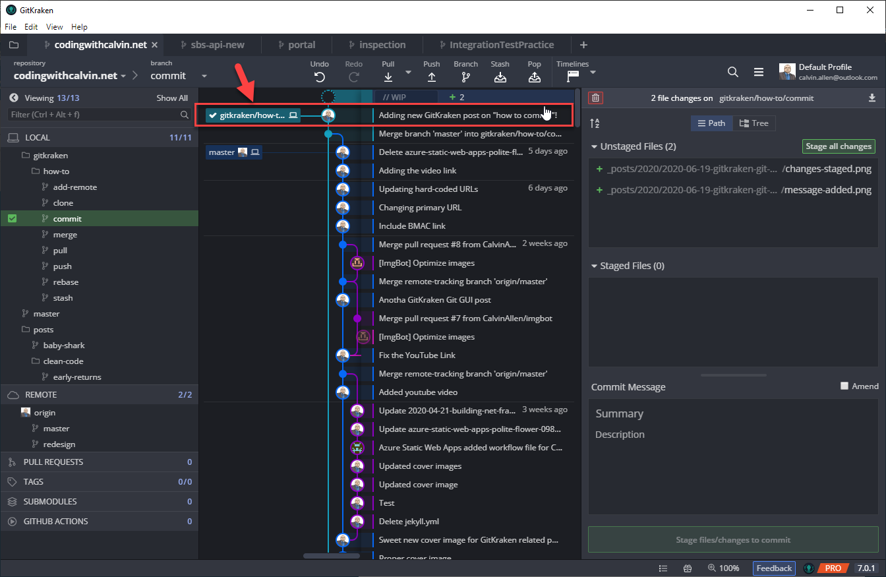

In my previous post, "[GitKraken Git GUI How-To: Add & Remove Files](https://www.codingwithcalvin.net/gitkraken-git-gui-how-to-add-remove-files)", we went over how to add and remove (stage and unstage) changes using the GitKraken Git GUI application.

In *this* post, I'm going to show you how to commit those changes to your repository.

The very first thing you need to do before you can commit, is to stage your changes!

Once you have your changes staged the way you like, now you must supply a commit message.  Git, and by extension GitKraken, allow you to have a "summary" and "description" for a commit.  You can use either one, or both, based on how you like to format your messages.  Personally, I generally only use the "description" for my commit messages.  Once you have entered a message (and this message can be as short as a single character, or much more polished), the green, "Commit changes to <#> files", will become enabled -

Clicking the, "Commit changes to <#> files", button will take the staged files, commit them to your local repository, and add a line to the commit history graph in the middle of the window -

That's it!  You've now committed your changes, and the process can start over with the next set of changes you need to make.  If you look closely in the last screenshot above, you'll see that I already have changes that are "unstaged" that I'll be "staging" and "committing" to make this blog post go live.

One thing to keep in mind (we'll go over this in the next post in the series) is that these changes are still ONLY AVAILABLE TO YOU.  You must "push" them to the remote repository to make them available to others.

---

I’ll be posting more “how to” articles for using the GitKraken Git GUI in the near future, as well as accompanying videos for each post (the video for this will be coming next). If you need any help or have any questions, please feel free to reach out directly.

If you’re interested in downloading the GitKraken Git GUI client and taking it for a spin, [please do me a favor and use my referral link to get started](https://www.gitkraken.com/invite/6zb3y67R). No obligations, of course, if you decide to. And, if you don’t want to, we’ll still be friends. :)

---

>This post, "GitKraken Git GUI How-To: Committing Changes", first appeared on [https://www.codingwithcalvin.net/gitkraken-git-gui-how-to-committing-changes](https://www.codingwithcalvin.net/gitkraken-git-gui-how-to-committing-changes)
